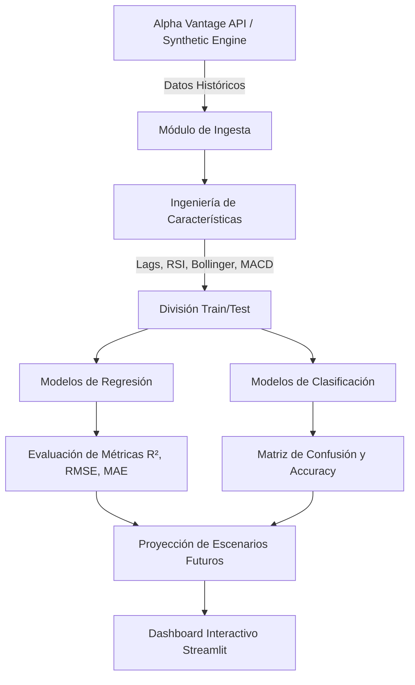

URL de streamlit: https://parcial-1-introduccion-al-maching-learningae-8b2mryqk6u5xpyija.streamlit.app/ 


# 📈 ProyecKeras: Financial Analytics & Machine Learning Suite

<p align="center">
  
  
  
  
  
  
  
  
  
</p>

---

## 📌 Descripción del Proyecto

**ProyecKeras** es una plataforma profesional de **Análisis Financiero Avanzado y Machine Learning**, diseñada para el monitoreo de activos bursátiles (acciones tecnológicas y materias primas), el cálculo en tiempo real de indicadores técnicos y la predicción de series de tiempo financieras mediante algoritmos supervisados bajo el estándar industrial **CRISP-ML(Q)**.

El proyecto integra dos interfaces clave:
1. 🌐 **Landing Page Web (`index.html`)**: Interfaz moderna en Dark Glassmorphism con visualización de metodología, demostración interactiva de gráficos y guía de despliegue.
2. 📊 **Dashboard de Analytics (`app.py`)**: Aplicación interactiva construida en **Streamlit** que permite ingestar datos reales de Alpha Vantage API (o datos sintéticos de alta fidelidad), entrenar modelos de regresión y clasificación, y proyectar escenarios futuros.

---

## ✨ Características Principales

- 📊 **Ingestión Multi-Fuente & Respaldo Continuo:** Conexión con Alpha Vantage API y fallback automático a un simulador estocástico para garantizar disponibilidad del 100%.
- 📈 **Indicadores Técnicos Avanzados:** RSI (Relative Strength Index), Bandas de Bollinger, MACD, Medias Móviles (SMA/EMA) y análisis de volatilidad.
- 🤖 **Suite de Machine Learning Supervisado:**
  - **Regresión:** Random Forest, Gradient Boosting, Ridge Regression, Decision Trees.
  - **Clasificación:** Random Forest Classifier (Tendencia Alcista / Bajista).
- 🔮 **Modelado de Escenarios Futuros:** Simulación de proyecciones a $N$ días con escenarios Optimista, Base y Pesimista.
- 📐 **Evaluación Cuantitativa Transparente:** Cálculo dinámico de $R^2$, RMSE, MAE, Exactitud, Matriz de Confusión e Importancia de Características (*Feature Importance*).
- 💾 **Exportación de Datos:** Descarga de series temporales procesadas y reportes de predicción en formato CSV.

---

## 🏗️ Arquitectura del Sistema



---

## 🛠️ Estructura del Repositorio

```text
ProyecKeras/
├── .github/
│   └── workflows/
│       └── ci.yml             # Integración Continua (CI/CD)
├── .gitignore                 # Configuración de archivos ignorados
├── LICENSE                    # Licencia MIT
├── README.md                  # Documentación oficial enriquecida con Badges
├── app.py                     # Aplicación principal de Streamlit
├── index.html                 # Landing Page profesional (Dark Glassmorphism)
├── style.css                  # Hoja de estilos globales para Landing y App
├── script.js                  # Lógica interactiva y gráficos demo para Landing Page
└── requirements.txt           # Dependencias de Python requeridas
```

---

## 🚀 Instalación y Ejecución Local

### 1. Clonar el Repositorio
```bash
git clone https://github.com/tu-usuario/ProyecKeras.git
cd ProyecKeras
```

### 2. Crear y Activar Entorno Virtual
- **Windows (PowerShell):**
  ```powershell
  python -m venv .venv
  .venv\Scripts\Activate.ps1
  ```
- **Linux / macOS:**
  ```bash
  python3 -m venv .venv
  source .venv/bin/activate
  ```

### 3. Instalar Dependencias
```bash
pip install --upgrade pip
pip install -r requirements.txt
```

### 4. Iniciar la Aplicación Streamlit (Python)
```bash
streamlit run app.py
```
> 🌐 La aplicación se abrirá automáticamente en tu navegador en `http://localhost:8501`.

### 5. Visualizar la Landing Page
Puedes abrir directamente `index.html` en tu navegador o ejecutar un servidor HTTP en Python:
```bash
python -m http.server 8000
```
> 🔗 Navega a `http://localhost:8000` para explorar la Landing Page interactiva.

---

## ⚙️ Metodología CRISP-ML(Q)

ProyecKeras implementa rigurosamente el estándar industrial de calidad en Machine Learning:

1. **Comprensión del Negocio & Datos:** Definición del objetivo cuantitativo bursátil y recopilación de datos de precios.
2. **Ingeniería de Datos:** Limpieza de nulos, cálculo de variaciones porcentuales, lags temporales e indicadores técnicos.
3. **Modelado:** Selección de hiperparámetros, ajuste de modelos ensemble y comparación cuantitativa.
4. **Evaluación:** Validación con conjunto de prueba retenido, evaluación de métricas de error y matriz de confusión.
5. **Despliegue:** Despliegue interactivo con Streamlit y Landing Page representativa.
6. **Monitoreo & Mantenimiento:** Respaldo sintético continuo y recalibración de características.

---

## 📄 Licencia

Este proyecto se distribuye bajo los términos de la Licencia **MIT**. Consulta el archivo [LICENSE](LICENSE) para más detalles.
